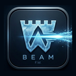

<p align="center">
  
</p>

<h1 align="center">Frostwall Beam</h1>

<p align="center">
  <strong>Encrypted file transfer for your local network.</strong><br />
  Pair two devices with a short code, verify with a rotating check digit, and send files or folders with end-to-end encryption — no cloud, no account.
</p>

<p align="center">
  <a href="https://github.com/batu3384/frostwall-beam/actions/workflows/ci.yml"></a>
  <a href="LICENSE"></a>
  
  
</p>

---

## Overview

**Frostwall Beam** is a cross-platform desktop app (macOS & Windows) for fast, private transfers over LAN. It combines a modern frost-themed UI with a security-first Rust core: SPAKE2 pairing, per-chunk AEAD encryption, Blake3 integrity checks, and explicit receiver approval before any payload is written to disk.

Built with **Tauri 2**, **Rust**, and **React** — one codebase, native installers, offline-friendly fonts, and minimal webview privileges.

## Highlights

| Area | What you get |
|------|----------------|
| **Discovery** | Pure-Rust mDNS — no system Bonjour dependency on Windows |
| **Pairing** | 6-digit code + key-confirmation MAC + 30s rotating verification code |
| **Transfer** | Files & folders, drag-and-drop, live speed/ETA, collision-safe renames |
| **Control** | Accept/decline incoming manifests; cancel in-flight transfers without disconnecting |
| **UX** | TR/EN UI, system/dark/light theme, transfer history, reduced-motion support |

## Features

### Security & privacy
- **End-to-end encryption** — XChaCha20-Poly1305 on every chunk
- **MITM-resistant pairing** — SPAKE2 + ephemeral X25519 + human-verifiable rotating code
- **Integrity** — per-file Blake3 hash verified before commit
- **Receiver gate** — manifest reviewed and accepted before bytes hit disk
- **Path hardening** — traversal, symlinks, dangerous Unicode, and system directories rejected
- **Forward secrecy** — fresh session keys each pairing

### Transfer experience
- Send **files or entire folders** (structure preserved)
- **Drag-and-drop** or native file/folder picker
- **Multi-host LAN selection** when several peers advertise on the same network
- **Configurable download directory** and **device name** (shown in mDNS + UI)
- **Cancel** an active transfer while keeping the encrypted session open

### Desktop polish
- Native dialogs and minimal Tauri capability surface
- Frost-themed UI with status pill, toasts, and progress breakdown
- Local transfer history (last 50 entries)

## Quick start

### Prerequisites

- [Node.js](https://nodejs.org/) 20+ and [pnpm](https://pnpm.io/)
- [Rust](https://rustup.rs/) stable (for Tauri backend)
- Platform tooling for [Tauri](https://v2.tauri.app/start/prerequisites/) (Xcode CLT on macOS, MSVC on Windows)

### Run from source

```bash
git clone https://github.com/batu3384/frostwall-beam.git
cd frostwall-beam
pnpm install
pnpm tauri dev
```

### Build installers

```bash
pnpm tauri build
```

| Platform | Output |
|----------|--------|
| macOS | `.app` / `.dmg` under `src-tauri/target/release/bundle/` |
| Windows | `.msi` / `.exe` under the same bundle directory |

> **Windows note:** Unsigned builds may trigger SmartScreen on first run. For distribution, Authenticode-sign the artifacts with `signtool` and your code-signing certificate.

## How to use (two devices)

1. **Host (Device A)** — *Host a session* → *Generate pairing code* → share the 6-digit code.
2. **Join (Device B)** — *Join a session* → enter the code → *Connect* → pick a host if multiple appear on the LAN.
3. **Verify** — confirm the **rotating 6-digit code** matches on both screens (anti-MITM check).
4. **Send** — drag files/folders onto the drop zone or use the file picker.
5. **Receive** — on the target device, review the manifest → **Accept** or **Decline**.
6. **Files land in** `~/Downloads/Frostwall Beam` by default, or your chosen folder in **Settings**.

**Single-machine smoke test:** run two app instances after `pnpm tauri build` — one hosts, one joins.

## Security model

```
Pairing code (SPAKE2)  →  session keys (HKDF)  →  encrypted frames (AEAD)
                              ↓
                    rotating liveness code (human check)
                              ↓
              manifest validation  →  user approval  →  chunked transfer + Blake3
```

- Wire protocol is versioned; incompatible peers fail fast.
- Transfers are **serialized** per session (one direction at a time) to keep UX and state simple.
- Temp files use a `.frostwallpart` suffix and are atomically renamed only after hash verification.
- Name collisions become `file (1).txt`, `file (2).txt`, … — never silent overwrite.

## Architecture

```
src-tauri/src/
├── crypto.rs       HKDF, XChaCha20-Poly1305, HMAC
├── pairing.rs      SPAKE2 + key-confirmation
├── liveness.rs     30s rotating verification code
├── discovery.rs    mDNS advertise / browse
├── transport.rs    length-delimited TCP framing
├── protocol.rs     Manifest · Accept · Reject · Cancel · Chunk · FileEnd · Done
├── transfer.rs     encrypt/decrypt, Blake3, path confinement
├── session.rs      handshake orchestration
└── commands.rs     Tauri API + session coordinator

src/
├── App.tsx         main UI (pairing, transfer, settings)
├── i18n.tsx        Turkish / English strings
├── errors.ts       backend error → localized message
├── history.ts      local transfer log
└── theme.ts        system / dark / light preference
```

## Development

```bash
# Frontend typecheck + production bundle
pnpm build

# Rust tests (60 unit tests; 1 mDNS test ignored in CI/sandbox)
cargo test --manifest-path src-tauri/Cargo.toml

# Lint / format (optional)
cargo fmt --manifest-path src-tauri/Cargo.toml --all
cargo clippy --manifest-path src-tauri/Cargo.toml -- -D warnings
```

CI runs on every push to `main` via [`.github/workflows/ci.yml`](.github/workflows/ci.yml) — Rust tests plus `pnpm build`.

## Roadmap

- [ ] Internet transfers via self-hosted mailbox + transit relay (Wormhole-style)
- [ ] Multi-peer sessions and QUIC-based connection migration

## Contributing

Issues and pull requests are welcome. Please run `cargo test` and `pnpm build` before submitting changes.

## License

[MIT](LICENSE) © Frostwall Beam contributors
